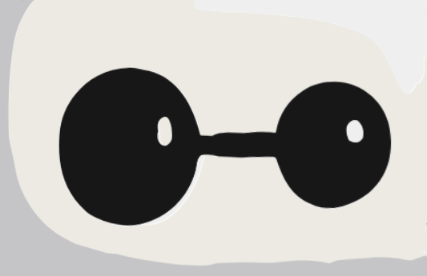

# ESP32 Reachy Mini Motion Controller



## What is this

This is a motion controller for the [Reachy Mini](https://www.pollen-robotics.com/reachy-mini/) robot: IMU readings from a [Waveshare ESP32-S3-Touch-AMOLED-1.8](https://www.waveshare.com/esp32-s3-touch-amoled-1.8.htm) board are translated directly onto Reachy's head, making this a sort of puppeteering device.

Hold the board like a remote (screen toward you, USB and side buttons down). Press **BOOT** to engage — the head follows your tilt and turn. Press BOOT again to clutch.

## How to run it

**1. Start the Python app** on the robot (Reachy Mini Desktop App / daemon must already be running):

```bash
cd reachy-mini-app
python -m venv .venv && source .venv/bin/activate
pip install -e .
python -m esp32_motion_controller.main
```

Or install **Motion Controller** from the Reachy Mini Desktop App: [V4C38/esp32_motion_controller](https://huggingface.co/spaces/V4C38/esp32_motion_controller).

**2. Set WiFi credentials**, then flash the board:

```bash
cp firmware/sdkconfig.local.example firmware/sdkconfig.local
# edit CONFIG_RMC_WIFI_SSID / CONFIG_RMC_WIFI_PASSWORD

. ~/esp/esp-idf/export.sh    # ESP-IDF v5.5.5, from a plain shell
cd firmware
idf.py set-target esp32s3    # first time only
idf.py -p /dev/cu.usbmodem101 flash
```

The board finds the app via mDNS. Double-tap the display for settings (gain, connect). Untethered use needs a 3.7V MX1.25 LiPo.

## Design decisions

The ESP32 owns *how the device moved* (Mahony IMU fusion at 250 Hz, samples sent at 20 Hz). Python owns *what the robot should do* (workspace limits, clutch, body follow). They talk over a fire-and-forget UDP JSON contract ([`PROTOCOL.md`](PROTOCOL.md)) — firmware and app must be upgraded together.

Engage snapshots the current pose as IMU zero. Head `x`/`y`/`z` stay put; only roll/pitch/yaw follow the board. Yaw is 1:1 for a short pan and ramps up for larger turns, using the board's right-edge heading so a nod does not yaw the head.

## License

[MIT](LICENSE)
